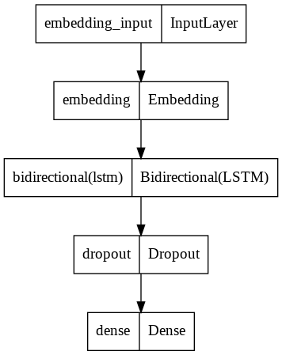

Generate Poem of Gebran khalil Gebran poem

 

to know more about him : https://en.wikipedia.org/wiki/Kahlil_Gibran

using `Tensorflow`

model structure : 

the dataset from kaggle download it and use it : https://www.kaggle.com/ahmedabelal/arabic-poetry
